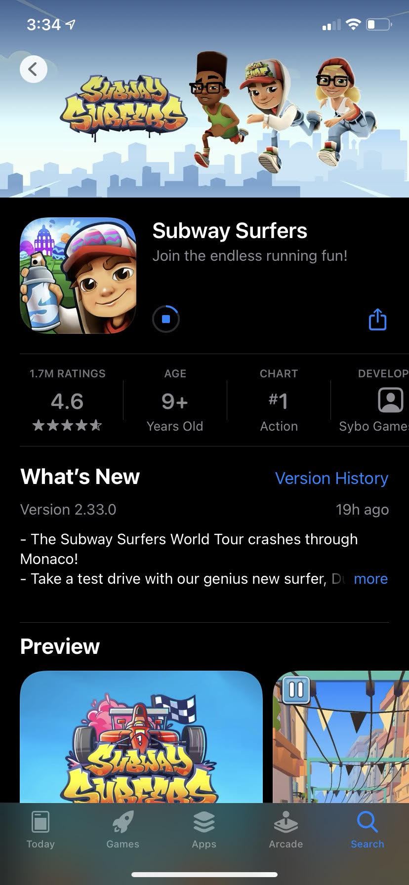

-----------

This documentation will provide an overview on the installation of the mobile game Subway Surfers. This app is available on iOS, Android, Kindle, and Windows Phone. It is free to download and play, however there are optional purchases available within the game to enhance your experience. The game features fun characters, eccentric environments, quirky design, and fun bonus challenges.

## Download
Installing the app is super easy!
1. Search "Subway Surfers" in your device's app store.
2. Download the app and enter any device passwords if necessary.
3. Now you're ready to surf the subway!

     
 

## Playing The Game
The objective is simple: keep hopping trains and dodging obstacles in order to avoid getting caught by the security gaurd. The longer you run, the faster you go, making it harder to avoid the obstacles. The only end to the game happens when you are eventually caught by the gaurd and the goal is to run for as long as possible.
1. To get started, simply tap the screen to start running.
2. Swipe left to jump left, swipe right to jump right, swipe up to jump, and swipe down to duck.
3. While running through the subway you can collect coins. These coins can be used to buy new characters, accessaries, and powerups.

  
  

     
5. Watch out for obstacles! if you trip on something, the security gaurd will get closer. If you trip again before getting far enough ahead, he will catch you and the game is over.
6. Subway Surfers also includes optional challenges to win extra prizes.

## Troubleshooting // Contact Info

>If you're having trouble downloading the app, check out you're devices support forums. if you use an apple device check [here][support].

>If you're having difficulties within the game click this [link][gamehelp].

>For any questions about this specific documentation, please contact Kristen Applebaum at applebaumkg@appstate.edu

--------

[support]: https://support.apple.com/en-us/HT207165
[gamehelp]: https://sybo.zendesk.com/hc/en-us
